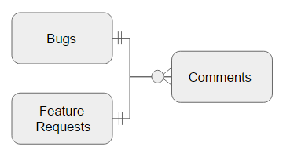
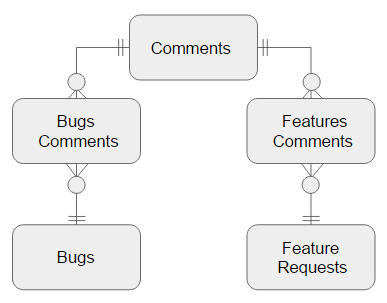
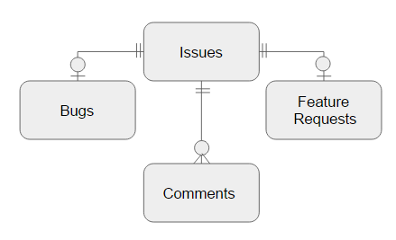

# 6. ポリモーフィック関連

## 6.１. アンチパターン
- 二重目的の外部キーを参照する

- Commentsテーブル

| 列名 | 型 | 備考 |
|----|----|----|
| comment_id | BIGINT(20) | |
| issue_type | VARCHAR(100) | 'Bugs'または'FeatureRequests'が格納される |
| issue_id | BIGINT(20) | BugsテーブルもしくはFeatureRequestsテーブルのissue_idに紐付く |
| comment | TEXT | |

### 6.2. デメリット
- 外部キーでは複数のテーブルを指定できないため、親テーブルの値と一致することを保証できない
- 参照整合性を保証できない
- Comments.issue_idの値は親テーブルの両方の主キー列に存在する可能性がある

## 6.3. 例外
- ありません。なるべく使用しないほうがよい
- ポリモーフィック関連をしようするとアプリケーションコードに過度に依存してしまう

## 6.4. 解決策
## 6.4.1. 参照を逆にする
- 参照を逆にする。問題の本質が何かを捉えれば導ける

- 参照整合性が保証され、アプリケーション依存もなくなる

## 6.4.2. 共通の親テーブルの作成

