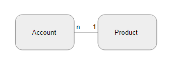
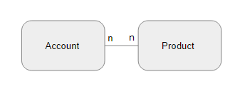
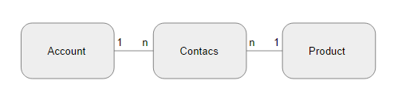

# 1. ジェイウォーク(信号無視)

## 1.1. はじめに
- 製品の連絡窓口としてアカウントを一人指定する
- 製品とアカウントの間には「多対1」の関連がある

- Accountテーブル

| 列名 | 型 |
|----|----|
| account_id | BIGINT(20) |
| account_name | VARCHAR(255) |

- Productテーブル  

| 列名 | 型 |
|----|----|
| product_id | BIGINT(20) |
| product_name | VARCHAR(255) |
| account_id | BIGINT(20) |

## 1.2. ケース
- 追加仕様で製品の連絡窓口としてアカウントを複数指定可能
- 製品とアカウントの間には「多対多」の関連がある

## 1.3. アンチパターン
- Productテーブルに複数アカウントを管理できるよう、account_idをカンマで繋いで管理する
- 1,2,34,567,600
- Productテーブル  

| 列名 | 型 |
|----|----|
| product_id | BIGINT(20) |
| product_name | VARCHAR(255) |
| account_id | VARCHAR(512) |

### デメリット
- 特定のアカウントに対しての追加、参照、更新、削除が面倒

### 例外
- リストをカンマ区切りで文字列として格納することも、非正規化の一例
- リスト内の特定のアカウントを参照しない等、文字列としてのみ扱う場合

## 1.4. 解決策
- AccountとProductの間に関連テーブルを作成する

- Contactsテーブル  

| 列名 | 型 |
|----|----|
| product_id | BIGINT(20) |
| account_id | BIGINT(20) |
