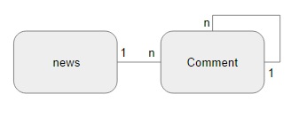
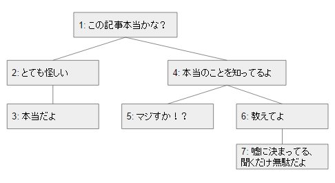

# 2. ナイーブツリー(素朴な木)

## 1.1. はじめに
- ある記事に対して、読者がコメントを書き込める
- 読書同士でのディスカッションも可能
- コメントはスレッド形式で表示される
- 隣接リストという、階層的なデータの格納に一般的な設計

- Newsテーブル

| 列名 | 型 |
|----|----|
| news_id | BIGINT(20) |

- Commentテーブル

| 列名 | 型 |
|----|----|
| comment_id | BIGINT(20) |
| parent_id | BIGINT(20) |
| news_id | BIGINT(20) |
| comment | TEXT |

| comment_id | parent_id | comment |
|----|----|----|
| 1 | NULL | この記事本当かな？ |
| 2 | 1 | とても怪しい？ |
| 3 | 2 | 本当だよ |
| 4 | 1 | 本当のことを知ってるよ |
| 5 | 4 | マジすか！？ |
| 6 | 4 | 教えてよ！ |
| 7 | 6 | 嘘に決まってる、聞くだけ無駄だよ |

### デメリット
- 階層の深さに制限がないため、ノードの件数取得するのが困難
- 途中のコメントを削除するときに、関連する行を探して削除しなければならない

### 例外
- 隣接リストの長所は、直近の親と子のノードを取得することや、簡単にデータの挿入ができるので、これらの操作しか行わない場合であれば効果を発揮する
- 再帰構文を使えば上記のデメリットも解決できる(MySqlには無い)

## 1.2. 解決策
- 経路列挙モデル、入れ子構造モデル、閉包モデル

## 1.2.1 経路列挙モデル
- Commentテーブル

| 列名 | 型 |
|----|----|
| comment_id | BIGINT(20) |
| path | varchar(255) |
| news_id | BIGINT(20) |
| comment | TEXT |

| comment_id | path | comment |
|----|----|----|
| 1 | 1/ | この記事本当かな？ |
| 2 | 1/2/ | とても怪しい？ |
| 3 | 1/2/3/ | 本当だよ |
| 4 | 1/4/ | 本当のことを知ってるよ |
| 5 | 1/4/5/ | マジすか！？ |
| 6 | 1/4/6/ | 教えてよ！ |
| 7 | 1/4/6/7/ | 嘘に決まってる、聞くだけ無駄だよ |

### デメリット
- ジェイウォークと同じく特定のコメントに対しての追加、参照、更新、削除が面倒
- PATHの最大長さがわからない

## 1.2.2 入れ子集合
- Commentテーブル

| 列名 | 型 |
|----|----|
| comment_id | BIGINT(20) |
| nsleft | INTEGER |
| nsright | INTEGER |
| news_id | BIGINT(20) |
| comment | TEXT |

| comment_id | nsleft | nsright | comment |
|----|----|----|
| 1 | 1 | 14 | この記事本当かな？ |
| 2 | 2 | 5 | とても怪しい？ |
| 3 | 3 | 4 | 本当だよ |
| 4 | 6 | 13 | 本当のことを知ってるよ |
| 5 | 7 | 8 | マジすか！？ |
| 6 | 9 | 12 | 教えてよ！ |
| 7 | 10 | 11 | 嘘に決まってる、聞くだけ無駄だよ |

- 入れ子構造が適しているのは、個々のノードの操作ではなくサブツリーに対する迅速かつ容易なクエリ実行が重要な場合
- ノードの挿入や移動は困難である

## 1.2.3 閉包テーブル
- Commentテーブル

| 列名 | 型 |
|----|----|
| comment_id | BIGINT(20) |
| news_id | BIGINT(20) |
| comment | TEXT |

- TreePathテーブル

| 列名 | 型 |
|----|----|
| ancestor(先祖) | BIGINT(20) |
| descendant(子孫) | BIGINT(20) |

| 先祖 | 子孫 | 先祖 | 子孫 | 先祖 | 子孫 |
|----|----|----|----|----|----|
| 1 | 1 | 1 | 7 | 4 | 6 |
| 1 | 2 | 2 | 2 | 4 | 7 |
| 1 | 3 | 2 | 3 | 5 | 5 |
| 1 | 4 | 3 | 3 | 6 | 6 |
| 1 | 5 | 4 | 4 | 6 | 7 |
| 1 | 6 | 4 | 5 | 7 | 7 |
