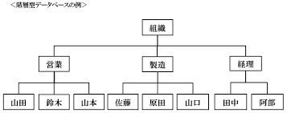
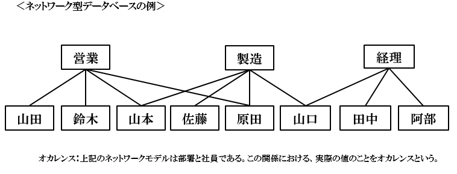

# 1.1.1
## データベースとは
- 1950年頃のアメリカ国防総省において、各所に分散していた軍事情報を1箇所に集め、そこに行きさえすればすべての情報が見られるようにしたデータの基地(Data Base)が由来

## データ独立
- 昔のシステム開発ではシステムごとにデータを保存してファイルなどに格納し、それぞれのシステムが別々にデータを管理していた
- データを1箇所で集中管理する
  - データを活用しやすい
  - データを検索しやすい
  - データの重複が避けられる

# 1.1.2
## データモデル
- データベースを構築する際、現実世界のデータをデータベースに適切に格納できるように変換する必要があり、その時のモデルをデータモデルという

## 主なデータモデル
- 階層型（ハイアラキカル）データモデル
- ネットワークデータモデル
- リレーショナルデータモデル
- オブジェクト指向データモデル

### 階層型データモデル
- データを階層型の親子関係で表現
- データ同士の関係はポインタでの関連付けで表現
- 親子関係は1対1か1対多

### ネットワークデータモデル
- 子が複数の親をもつ場合などを網状の形で表現

### リレーショナルデータモデル
- テーブルとテーブル間の関連でデータを表現
- 数学の集合論をもとに考え出されたモデル
- 考案者はエドガー・F・コッド

### オブジェクト指向データモデル
- データと操作を一体化して扱う
- データの型であるクラスを生成し、クラスからデータの数だけインスタンスを生成する

## リレ－ショナルデータモデル
### 考え方
- 表 => 関係、リレーション
- 行 => 組、タプル
- 列 => 属性、カラム
 
